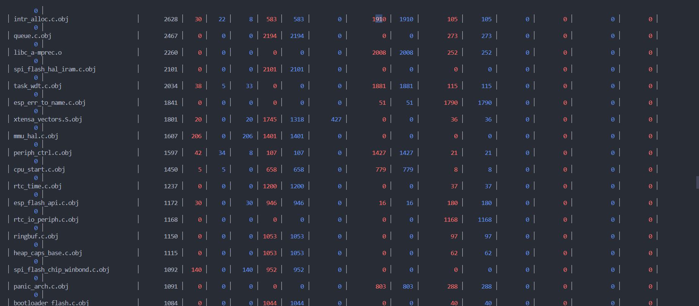

# Lab6_1 Basic ESP32 Project Structure

This project demonstrates a standard ESP32 project structure using ESP-IDF and CMake, as described in the lab instructions.

# บันทึกผลการทดลอง
idf.py size

idf.py size-components

idf.py size-files

แก้ไข main/lab6_1_basic_build.c:

# Lab6_1 Basic ESP32 Project Structure

## คำตอบคำถามทบทวน

1. **Docker vs Native Setup**: Docker ช่วยให้ environment ของ ESP-IDF เหมือนกันทุกเครื่อง ลดปัญหา dependency และการตั้งค่าที่ต่างกันบนแต่ละเครื่อง ไม่ต้องติดตั้ง ESP-IDF บน host system และสามารถลบ container ได้ง่ายโดยไม่ทิ้งไฟล์ขยะ

2. **Build Process**: ขั้นตอนการ build ใน Docker คือ source code จะถูก compile ด้วย idf.py ภายใน container ซึ่งจะสร้าง binary output ในโฟลเดอร์ build โดยใช้ CMake เป็นตัวจัดการ build system

3. **CMake Files**: ไฟล์ CMakeLists.txt ระดับบนสุดใช้กำหนด project และเรียกใช้ project.cmake ของ ESP-IDF ส่วนไฟล์ใน main/ ใช้ระบุ source file และ include directory ที่ต้องการ build ใน component นั้น ๆ

4. **Git Ignore**: .gitignore มีความสำคัญในการกันไม่ให้ไฟล์ build, ไฟล์ชั่วคราว, และไฟล์ที่ไม่จำเป็นถูก track ใน git ช่วยให้ repository สะอาดและลดปัญหาไฟล์ขยะ

5. **Container Persistence**: ข้อมูลที่อยู่ใน container (เช่น build output) จะหายไปเมื่อ container ถูกลบ แต่ไฟล์ใน project directory ที่ map มาจาก host จะยังอยู่

6. **Development Workflow**: การใช้ Docker ทำให้ workflow การพัฒนาเหมือนกันทุกเครื่อง ลดปัญหา environment ต่างกัน ในขณะที่ native system อาจมีปัญหา dependency หรือ version mismatch ได้ง่ายกว่า
